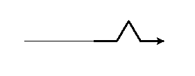

   
Koch Snowflake
===============
In this assignment, you will  make a snowflake. But not just any snowflake, you will make a *Koch* snowflake using a process called recursion. The Koch snowflake is a *fractal* because it consists of three copies of the *Koch curve*, arranged along the sides of a triangle:   
   
The base case is just the line:   
   
At the next level, the straight line is replaced by four lines, each one third the length of the parent, arranged this way.   
   
Each new level replaces the straight lines of the previous level with bent lines, exactly the same way. The red color was added here to make the previous level more visible. Your version can be all one color.   
   

Suggested steps to get started:
---------------------------------
1. Here's some starter code to draw one side of the Koch snowflake:
```Python
import turtle
tommy = turtle.Turtle()
def koch(sideLength, order):
    if order > 0:
        for angle in [60, -120, 60, 0]:
            tommy.forward(sideLength/3)
            tommy.left(angle)
    else:
        tommy.forward(sideLength)

# Test
koch(100, 0) #length of side is 100, order of 0 means no outer bend
tommy.pensize(3)
koch(100, 1) #length of side is 100, order of 1 means one outer bend
```

2. Run and test the code. You should see the following output   
   
3. The problem with the starter code is that it won't put another outer bend inside of another. To do that, we'll need to make the function *recursive*. You will want to replace the commented line of code with a recursive call to `koch` with a side length of `sideLength/3` and an order one less than `order`. By substracting one, our function will progress towards the *base case* of a straight line.
 
 ```Python
import turtle
tommy = turtle.Turtle()
def koch(sideLength, order):
    if order > 0:
        for angle in [60, -120, 60, 0]:
            tommy.forward(sideLength/3) #replace this with a recursive call to koch
            tommy.left(angle)
    else:
        tommy.forward(sideLength)

# Test
tommy.pensize(3)
koch(100, 2) #order of 2 means one outer bend inside of each outer bend
```

4. When you get one side of the snowflake working, combine three of them to make the entire snowflake. To do this, define a new function `snowflake`:
```Python
def snowflake(sideLength, order):
    # loop 3 times
      # call koch to make one side with the given sideLength and order
      # turn tommy to the right by 120 degrees
```
5. Add code to call the `snowflake` function
6. 
Extension:
---------
If you have extra time, experimented with color and fill. You can make multiple snowflakes of random colors, orders and side lengths. You can generate your own version of the Koch Snow Flake by changing the turning angles. See the examples below and check out http://en.wikipedia.org/wiki/Koch_snowflake for examples and implement your favorite.
  

Samples of Student work
-----------------------
*none yet!*
