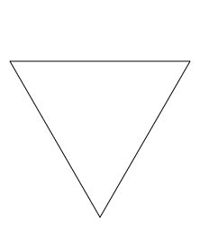
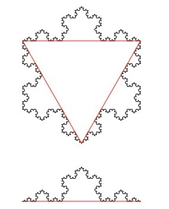
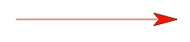
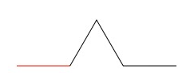
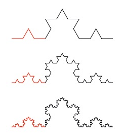
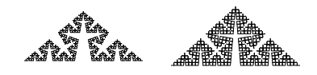

   
Koch Snowflake
===============
In this assignment, you will  make a snowflake. But not just any snowflake, you will make a *Koch* snowflake using a process called recursion. The Koch snowflake is a *fractal* because it consists of three copies of the *Koch curve*, arranged along the sides of a triangle:   
   
The base case is just the line:   
   
At the next level, the straight line is replaced by four lines, each one third the length of the parent, arranged this way.   
   
Each new level replaces the straight lines of the previous level with bent lines, exactly the same way. The red color was added here to make the previous level more visible. Your version can be all one color.   
   


Complete this recursive procedure to draw one side of the Koch snowflake:
```Python
  def koch(t, n): #t is Turtle Object, n is the length
  #Draws a koch curve with length n
  if n < 10:
    t.fd(n)
    return

  #recursive and stepping code goes here.
  ```


 
 
 
Hint:   

Draw a Koch curve with length x/3.   
Turn left 60 degrees.   
Draw a Koch curve with length x/3.   
Turn right 120 degrees.   
Draw a Koch curve with length x/3.   
Turn left 60 degrees.   
Draw a Koch curve with length x/3.   
The exception is if x is less than 3: in that case, you can just draw a straight line with length x.   


When you get one side of the snowflake working, combine three of them to make the entire snowflake. Why does the size in each recursive call have to be one third the size of the previous level? There are four copies; why not one fourth the size? 

Extension:
---------
   
If you have extra time, you can generate your own version of the Koch Snow Flake by changing the turning angles. See http://en.wikipedia.org/wiki/Koch_snowflake for examples and implement your favorite.


Suggested steps to get started:
---------------------------------
1. TBD

Samples of Student work
-----------------------
*none yet!*
